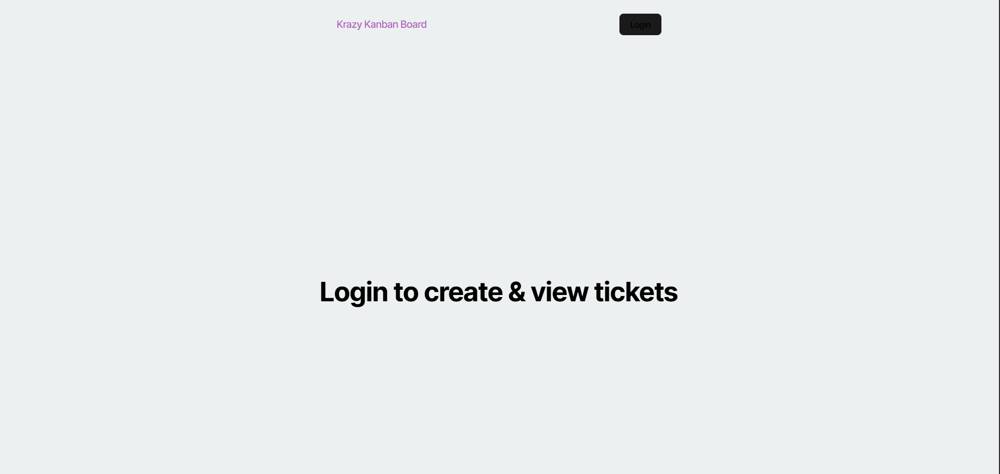

Readme
Username
sfar93

Email
salehf1993@gmail.com

Description
User will be able to log in and create a ticket edit ticket from todo, working, and done.

Table of Contents
-Installation -Usage -License -Contributer -tests -questions

Contributers
Saleh

Installation
undefined

Questions
My Github profile

github and email to reach the contributer(s)

Tests
test 1, logging in.
test 2, ticket page
test 3. testing functionalty of ticket processs through adding, edit, and deleting. 

Usage
https://kanban-board-fj1q.onrender.com/

License
This project is licensed under the MIT License - see the LICENSE file for details.

MIT License https://opensource.org/licenses/MIT